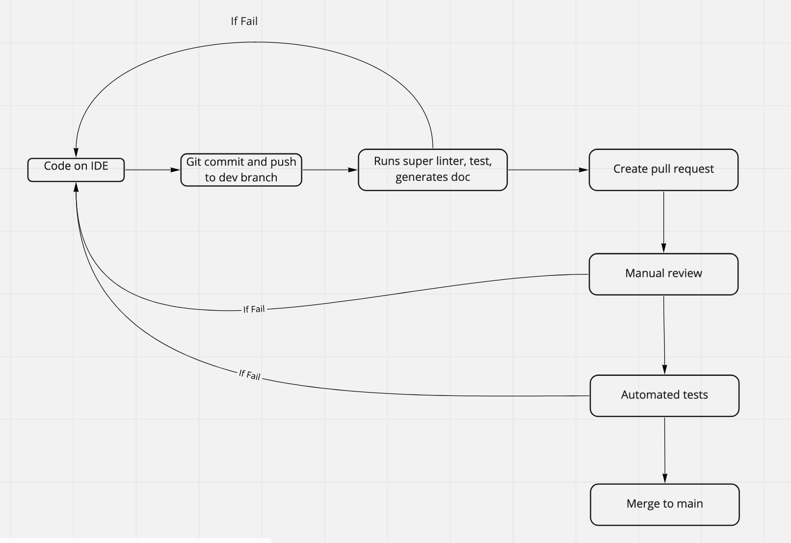

# Pipeline Status Phase 1
## Current Issues
`As of right now, our build pipeline has a functioning linter and JSDoc generator. However, code quality checks such as codacy are currently not properly integrated (returns exit code 100). We also have jest, but since we have not included any tests, it also isn't functioning yet and returns an error (exit code 1). We are still in the process of setting up a means of deploying our application through Azure. We have made an account and are working towards deployment.`
## Current Functionality
`Currently, the pipeline only recognizes pushes to branches and pull requests, and performs a jsdoc generator, linter, code quality checker, and tester (jest). We plan to make it so that pushes will not perform if not all checks are passed, but is currently disabled until we resolve the codacy and jest issue. Once that is complete however, upon comitting and pushing from the IDE, the pipeline will run various tests, generate a JSDoc, and check the code for any style fixes and cleanliness. Should it be successful, we will create a pull request, which is first vetted manually, before being merged onto main. Before merging to main, we will run tests and manually look over code. If a test fails, we are to return to our IDE, debug, push and repeat the process.`
## Future Pipeline Plans and Fixes
`We are working towards getting codacy to run and recognize code through the pipeline, as well as setting up our deployment with Azure. We are also looking into the jest error we are getting and how to fix it. As we approach the second phase, the diagram pipeline will also be updated accordingly as we add more functionality. We still have yet to include a staging phase to the pipeline before it is deployed.`
 

